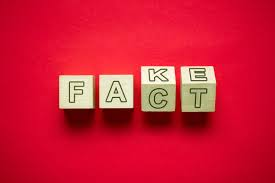
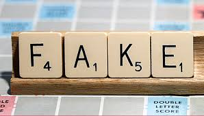

#   Final Project: FakeNewsDetection    

Presentation Date: 7/10/2021
                                                                                                                         
Project Team: Jennifer Duffy, Robin Evans, Jennifer Mattingly  

Project Summary:

1.     Define the problem statement
2.     Import libraries/datasets and perform preliminary data processing
3.     Perform Exploratory data analysis using visualization tools and/ or statistical methods
4.     Perform data preprocessing and cleaning
5.     Visualize datasets
6.     Prepare the data by performing tokenization and padding
7.     Train an LSTM Model
8.     Assess/evaluate trained model performance
9.     Create user interface/ interaction
10.  Deploy to Heroku

Dependencies Used for Model:
|--------------------------|
tensorflow
jupyterthemes
plotly
nbformat
nltk
spacy
WordCloud
gensim
matplotlib
Sklearn
Keras
pickle

FAKE DETECTION MODEL ACCURACIES: 
|       MODEL       |     ACCURACY    |      RUNTIME       |
|-------------------|-----------------|--------------------|
LOGISTIC REGRESSION |      98.64%     | 10.355125665664673 | 
GRADIENT            |      99.58%     | 172.46598076820374 |
RANDOM FOREST       |      99.14%     | 354.86133909225464 |

   ![]{Images/Reliable.jpg)

------------------------------------------------------------------------------------------------------------------
Project Proposal: Machine Learning to Find Fake News

The objective of our project is to use machine learning to determine whether a given article is fake or real news. We will create a web-based user interface in which a user can type in some text and the algorithm will predict whether the news is fake or real. Ideally, companies, governments, and other entities can use this type of process to determine the likelihood of whether a news article that is being spread by social media or other means is fake or is true.

Data Source:

https://www.kaggle.com/clmentbisailon/fake-and-real-news-dataset 

Files:
True.csv
Fake.csv

  
Proposed Data Analysis Process: 

•    Use Python to import the dataset. 
•    Perform exploratory data analysis and visualize the dataset. 
•    Perform data cleaning such as removing stop words. 
•    Perform tokenizing for the model. 
•    Build and train the model. 
•    Assess the performance of the model. 
•    Save the model. 
•    Deploy the app to the web. 

Tools/ libraries: 

Python/ Pandas 
Python Matplotlib 
Scikit-Learn/other machine learning libraries 
SQL (pgAdmin) 
Amazon Web Services (AWS) 
Heroku (Web deployment) 
Portions of code adapted from: 
https://www.kaggle.com/rodolfoluna/fake-news-detector  /
https://scikit-learn.org/stable/auto_examples/model_selection/plot_confusion_matrix.html 

                                     

